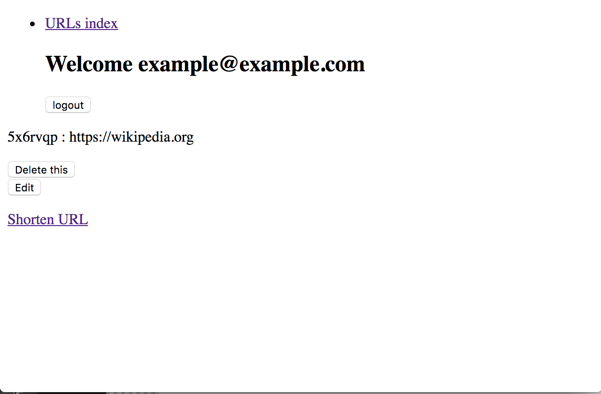
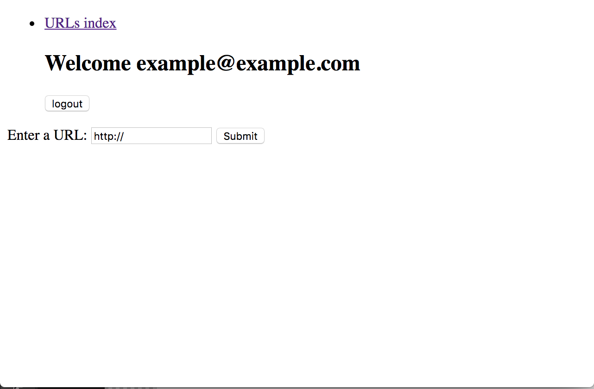

# <code>TinyApp</code> Project

TinyApp is a full stack web application build with Node and Express that allows users to shorten long URLs.

## Final Product

## Dependencies

- Node.js
- Express
- EJS
- bcrypt
- body-parser
- cookie-session

## Getting Started

- Install all depencies using `npm install` command
- Run the development web server using the `node server.js` command

## Functional Requirements

### User Stories

As an avid twitter poster,
I want to be able to shorten links
so that I can fit more non-link text in my tweets.

As a twitter reader,
I want to be able to visit sites via shortened links,
so that I can read interesting content.

(Stretch) As an avid twitter poster,
I want to be able to see how many times my subscribers visit my links
so that I can learn what content they like.

## Display Requirements

<ul>
  <li>Site Header:
    <ul>
      <li>if a user is logged in, the header shows:
        <ul>
          <li>the user's email</li> [x]
          <li>a logout button which makes a POST request to <code>/logout</code></li> [x]
        </ul>
      </li>
      <li>if a user is not logged in, the header shows:
        <ul>
          <li>a link to the login page (<code>/login</code>)</li> [x]
          <li>a link to the registration page (<code>/register</code>)</li> [x]
        </ul>
      </li>
    </ul>
  </li>
</ul>

## Behaviour Requirements

<ul>
  <li><b><code>GET /</code></b>
    <ul>
      <li>if user is logged in:
        <ul>
          <li>(<b>Minor</b>) redirect to <code>/urls</code></li>
        </ul>
      </li>
      <li>if user is not logged in:
        <ul>
          <li>(<b>Minor</b>) redirect to <code>/login</code> [x]
        </ul>
      </li>
    </ul>
  </li>
  <li><b><code>GET /urls</li></code></b>
    <ul>
      <li>if user is logged in:
        <ul>
          <li>returns HTML with:
            <ul>
              <li>the site header (see Display Requirements above)</li> [x]
              <li>a list (or table) of URLs the user has created, each list item containing:
                <ul>
                  <li>a short URL</li> [x]
                  <li>the short URL's matching long URL</li> [x]
                  <li>an edit button which makes a GET request to <code>/urls/:id</code></li> [x]
                  <li>a delete button which makes a POST request to <code>/urls/:id/delete</code></li> [x]
                  <li>(<b>Stretch</b>) the date the short URL was created</li>
                  <li>(<b>Stretch</b>) the number of times the short URL was visited</li>
                  <li>(<b>Stretch</b>) the number number of unique visits for the short URL</li>
                </ul>
              </li>
              <li>(<b>Minor</b>) a link to "Create a New Short Link" which makes a GET request to <code>/urls/new</code></li> [x]
            </ul>
            <li>if user is not logged in:
              <ul>
                <li>returns HTML with a relevant error message</li> [x]
          </li>
        </ul>
        <li><b><code>GET /urls/new</code></b>
          <ul>
            <li>if user is logged in:
              <ul>
                <li>returns HTML with:</li>
                <li>the site header (see Display Requirements above)</li> [x]
                <li>a form which contains:
                  <ul>
                    <li>a text input field for the original (long) <code>URL</code></li> [x]
                    <li>a submit button which makes a POST request to <code>/url</code></li> [x]
                  </ul>
                </li>
              </ul>
            <li>if user is not logged in:
              <ul>
                <li>redirects to the <code>/login</li> page</li> [x]
      </li>
    </ul>
  </li>
</ul>