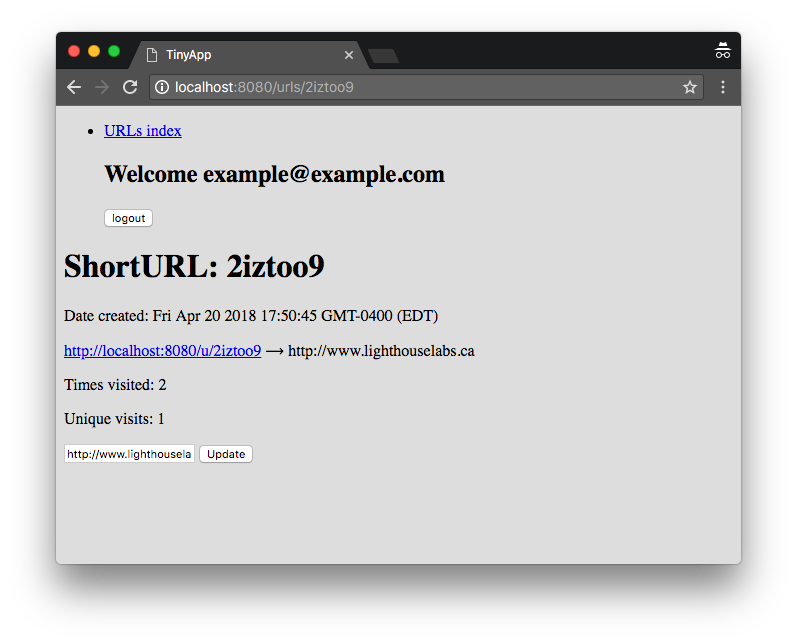

# <code>TinyApp</code> Project

TinyApp is a full stack web application build with Node and Express that allows users to shorten long URLs.

## Final Product

Home screen of logged in user

Create new short URL page

Edit existing short URL page

## Dependencies

- Node.js
- Express
- EJS
- bcrypt
- body-parser
- cookie-session

## Getting Started

- Install all depencies using `npm install` command
- Run the development web server using the `node server.js` command

## Functional Requirements

### User Stories

As an avid twitter poster,
I want to be able to shorten links
so that I can fit more non-link text in my tweets.

As a twitter reader,
I want to be able to visit sites via shortened links,
so that I can read interesting content.

(Stretch) As an avid twitter poster,
I want to be able to see how many times my subscribers visit my links
so that I can learn what content they like.

## Display Requirements

<ul>
<li>Site Header:
<ul>
<li>if a user is logged in, the header shows:
<ul>
<li>✅ the user's email</li>
<li>✅ a logout button which makes a POST request to <code>/logout</code></li>
</ul>
</li>
<li>if a user is not logged in, the header shows:
<ul>
<li> ✅ a link to the login page (<code>/login</code>)</li>
<li> ✅ a link to the registration page (<code>/register</code>)</li>
</ul>
</li>
</ul>
</li>
</ul>

## Behaviour Requirements

<ul>
<li>
<code>GET /</code>

<ul>
<li>if user is logged in:

<ul>
<li> ✅ (Minor) redirect to <code>/urls</code></li>
</ul></li>
<li>if user is not logged in:

<ul>
<li>✅ (Minor) redirect to <code>/login</code></li>
</ul></li>
</ul></li>
<li>
<code>GET /urls</code>

<ul>
<li>if user is logged in:

<ul>
<li>returns HTML with:</li>
<li> ✅ the site header (see Display Requirements above)</li>
<li> ✅ a list (or table) of URLs the user has created, each list item containing:

<ul>
<li> ✅ a short URL</li>
<li> ✅ the short URL's matching long URL</li>
<li> ✅ an edit button which makes a GET request to <code>/urls/:id</code></li>
<li> ✅ a delete button which makes a POST request to <code>/urls/:id/delete</code></li>
<li> ✅ (Stretch) the date the short URL was created</li>
<li> ✅ (Stretch) the number of times the short URL was visited</li>
<li> ✅ (Stretch) the number number of unique visits for the short URL</li>
</ul></li>
<li> ✅ (Minor) a link to "Create a New Short Link" which makes a GET request to <code>/urls/new</code></li>
</ul></li>
<li>if user is not logged in:

<ul>
<li> ✅ returns HTML with a relevant error message</li>
</ul></li>
</ul></li>
<li>
<code>GET /urls/new</code>

<ul>
<li>if user is logged in:

<ul>
<li>returns HTML with:</li>
<li> ✅ the site header (see Display Requirements above)</li>
<li>a form which contains:

<ul>
<li> ✅ a text input field for the original (long) URL</li>
<li> ✅ a submit button which makes a POST request to <code>/urls</code></li>
</ul></li>
</ul></li>
<li>if user is not logged in:

<ul>
<li>redirects to the <code>/login</code> page</li>
</ul></li>
</ul></li>
<li>
<code>GET /urls/:id</code>

<ul>
<li>if user is logged in and owns the URL for the given ID:

<ul>
<li>returns HTML with:</li>
<li> ✅ the site header (see Display Requirements above)</li>
<li> ✅ the short URL (for the given ID)</li>
<li>a form which contains:

<ul>
<li> ✅ the corresponding long URL</li>
<li> ✅ an update button which makes a POST request to <code>/urls/:id</code></li>
</ul></li>
<li> ✅ (Stretch) the date the short URL was created</li>
<li> ✅ (Stretch) the number of times the short URL was visited</li>
<li> ✅ (Stretch) the number of unique visits for the short URL</li>
</ul></li>
<li>if a URL for the given ID does not exist:

<ul>
<li> ✅ (Minor) returns HTML with a relevant error message</li>
</ul></li>
<li>if user is not logged in:

<ul>
<li> ✅ returns HTML with a relevant error message</li>
</ul></li>
<li>if user is logged it but does not own the URL with the given ID:

<ul>
<li> ✅ returns HTML with a relevant error message</li>
</ul></li>
</ul></li>
<li>
<code>GET /u/:id</code>

<ul>
<li>if URL for the given ID exists:

<ul>
<li> ✅ redirects to the corresponding long URL</li>
</ul></li>
<li>if URL for the given ID does not exist:

<ul>
<li> ✅ (Minor) returns HTML with a relevant error message</li>
</ul></li>
</ul></li>
<li>
<code>POST /urls</code>

<ul>
<li>if user is logged in:

<ul>
<li> ✅ generates a short URL, saves it, and associates it with the user</li>
<li> ✅ redirects to <code>/urls/:id</code>, where <code>:id</code> matches the ID of the newly saved URL</li>
</ul></li>
<li>if user is not logged in:

<ul>
<li> ✅ (Minor) returns HTML with a relevant error message</li>
</ul></li>
</ul></li>
<li>
<code>POST /urls/:id</code>

<ul>
<li>if user is logged in and owns the URL for the given ID:

<ul>
<li> ✅ updates the URL</li>
<li> ✅ redirects to <code>/urls</code></li>
</ul></li>
<li>if user is not logged in:

<ul>
<li> ✅ (Minor) returns HTML with a relevant error message</li>
</ul></li>
<li>if user is logged it but does not own the URL for the given ID:

<ul>
<li> ✅ (Minor) returns HTML with a relevant error message</li>
</ul></li>
<li><code>POST /urls/:id/delete</code></li>
<li>if user is logged in and owns the URL for the given ID:

<ul>
<li> ✅ deletes the URL</li>
<li> ✅ redirects to <code>/urls</code></li>
</ul></li>
<li>if user is not logged in:

<ul>
<li> ✅ (Minor) returns HTML with a relevant error message</li>
</ul></li>
<li>if user is logged it but does not own the URL for the given ID:

<ul>
<li> ✅ (Minor) returns HTML with a relevant error message</li>
</ul></li>
</ul></li>
<li>
<code>GET /login</code>

<ul>
<li>if user is logged in:

<ul>
<li> ✅ (Minor) redirects to <code>/urls</code></li>
</ul></li>
<li>if user is not logged in:

<ul>
<li>returns HTML with:</li>
<li>a form which contains:

<ul>
<li> ✅ input fields for email and password</li>
<li> ✅ submit button that makes a POST request to <code>/login</code></li>
</ul></li>
</ul></li>
</ul></li>
<li>
<code>GET /register</code>

<ul>
<li>if user is logged in:

<ul>
<li> ✅ (Minor) redirects to <code>/urls</code></li>
</ul></li>
<li>if user is not logged in:

<ul>
<li>returns HTML with:</li>
<li>a form which contains:

<ul>
<li> ✅ input fields for email and password</li>
<li> ✅ a register button that makes a POST request to <code>/register</code></li>
</ul></li>
</ul></li>
</ul></li>
<li>
<code>POST /login</code>

<ul>
<li>if email and password params match an existing user:

<ul>
<li> ✅ sets a cookie</li>
<li> ✅ redirects to <code>/urls</code></li>
</ul></li>
<li>if email and password params don't match an existing user:

<ul>
<li> ✅ returns HTML with a relevant error message</li>
</ul></li>
</ul></li>
<li>
<code>POST /register</code>

<ul>
<li>if email or password are empty:

<ul>
<li> ✅ returns HTML with a relevant error message</li>
</ul></li>
<li>if email already exists:

<ul>
<li> ✅ returns HTML with a relevant error message</li>
</ul></li>
<li>otherwise:

<ul>
<li> ✅ creates a new user</li>
<li> ✅ encrypts the new user's password with <code>bcrypt</code></li>
<li> ✅ sets a cookie</li>
<li> ✅ redirects to <code>/urls</code></li>
</ul></li>
</ul></li>
<li>
<code>POST /logout</code>

<ul>
<li> ✅ deletes cookie</li>
<li> ✅ redirects to <code>/urls</code></li>
</ul></li>
</ul>